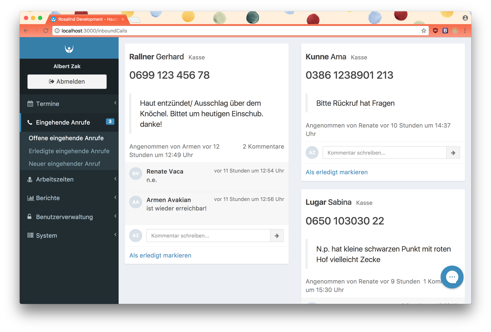
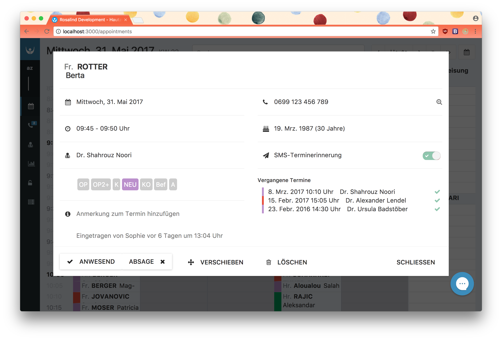
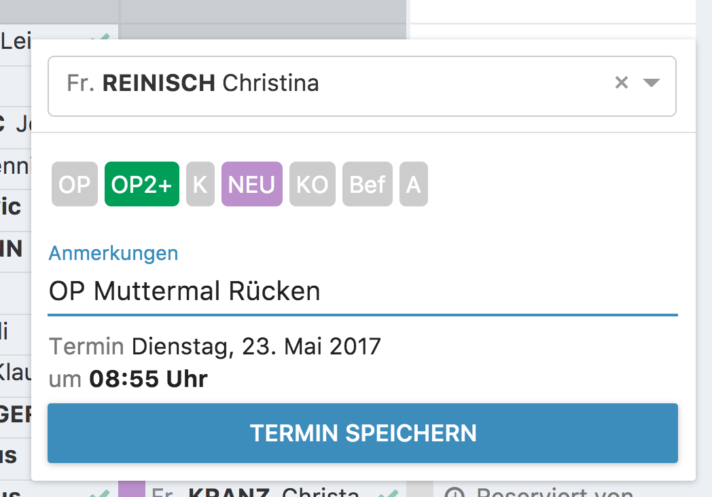
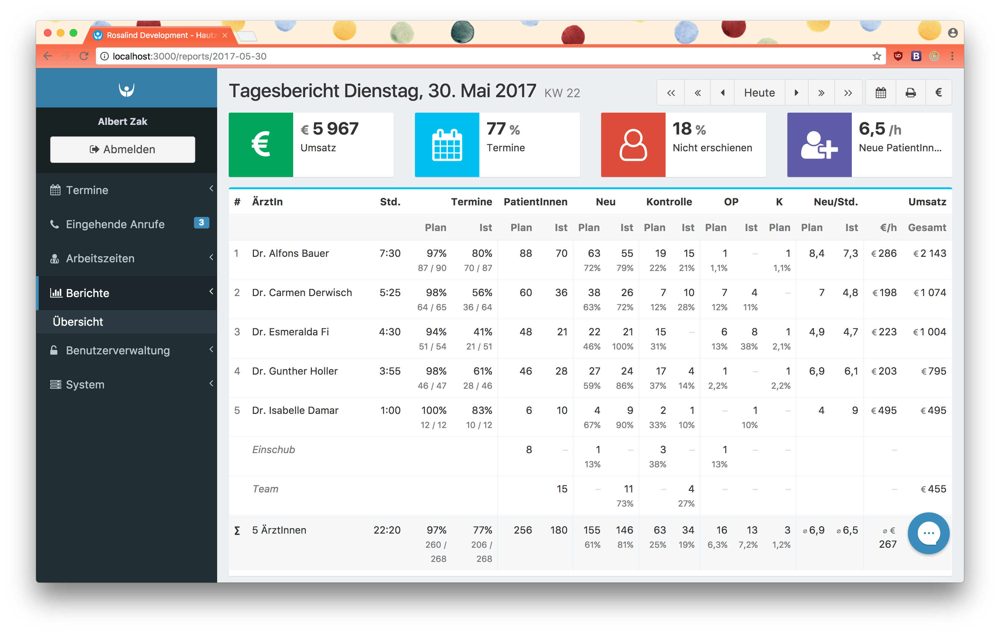

<h1>Rosalind</h1>
<small>Built with love in Vienna, Austria.</small>  

&nbsp;
 

&nbsp;
 

&nbsp;
 

## Quickstart

### Develop

`yarn run start`

`yarn run client:start`

### Test

`yarn run test`

### Deploy

`yarn run client:build`

## Screenshots

<i>Inbound Calls</i>

<i>Appointment Detail</i>

<i>New Appointment</i>

<i>Report</i>

